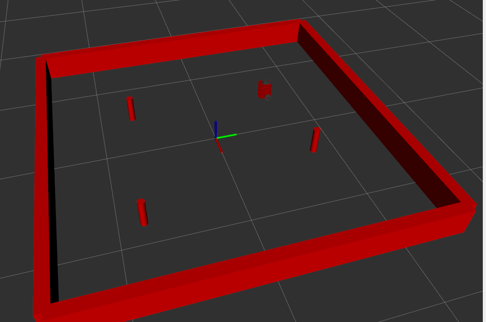

# Nusim
 - Author: Ananya Agarwal
 - Published: Winter 2024

# Package description
The nusim package serves as a simulation and visualization tool designed for turtlebot3 robots. Utilizing rviz2 for visualization, it establishes a simulated environment featuring stationary walls, obstacles, and the real-time tracking of the robot's position. This class publishes information such as the current simulation timestep, markers for obstacles and walls in Rviz. The timer_callback function continuously updates the simulation at each timestep. Additionally, the package offers a reset service, enabling the simulation to return to its initial state and restart. A teleport service is also provided, allowing the turtlebot to be relocated to any desired pose. A broadcaster broadcasts the robots TF frames to a topic for visualization in Rviz. 

# Launchfile description
 - nusim.launch.xml:
    - The launch file launches a turtlebot3 by launching the launch file nuturtle_description/launch/load_one.launch.py.
    - The node nusim is also launched which is the main simulation node.
    - Rviz is launched to display the robots and the environment.
    - ```ros2 launch nusim nusim.launch.xml```


# Parameters
- rate (int): Timer callback/simulation frequency [Hz]
- x0 (float): Initial x coordinate of the robot [m]
- y0 (float): Initial y coordinate of the robot [m]
- theta0 (float): Initial theta angle of the robot [radians]
- obstacles/x (std::vector): Vector of x coordinates for each obstacle [m]
- obstacles/y (std::vector): Vector of y coordinates for each obstacle [m]
- obstacles/r (float): Radius of cylindrical obstacles [m]
- arena_x_length (float): Inner lenght of walls in x direction [m]
- arena_y_length (float): Inner lenght of walls in y direction [m]

# Example



