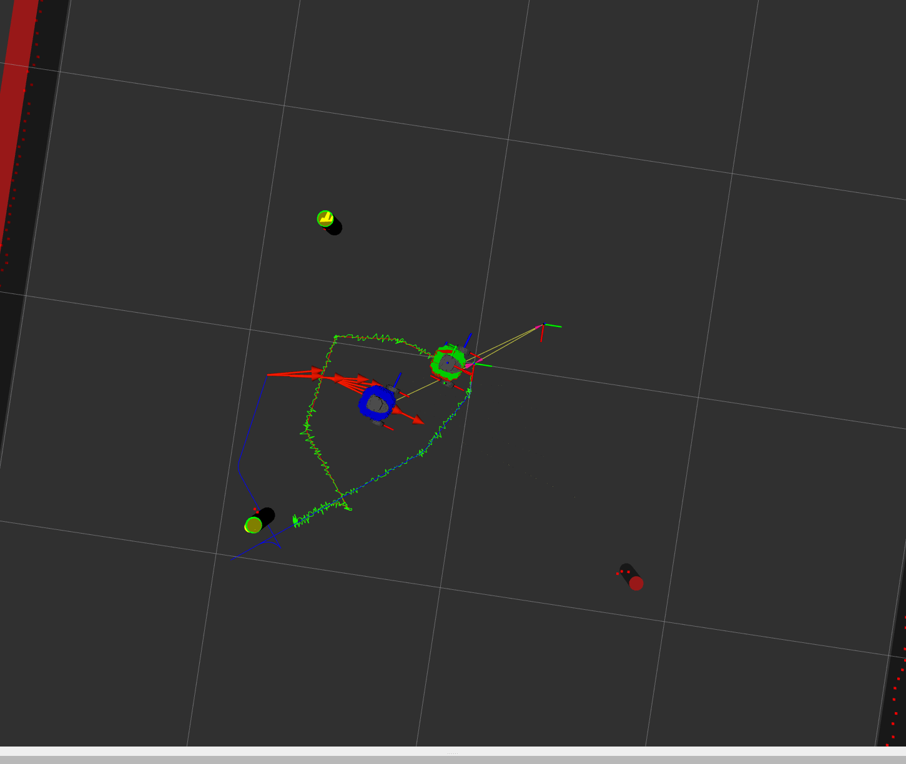

# Nuslam
 - Author: Ananya Agarwal
 - Published: Winter 2024

# Package description
Nuslam package implements the EKF SLAM to map and localize the position of green robot.

# Launchfile description
 - slam.launch.xml:
    - Rviz is launched to display the robots and the environment.
    - ```ros2 launch nuslam slam.launch.xml use_rviz:=true```

# Example



