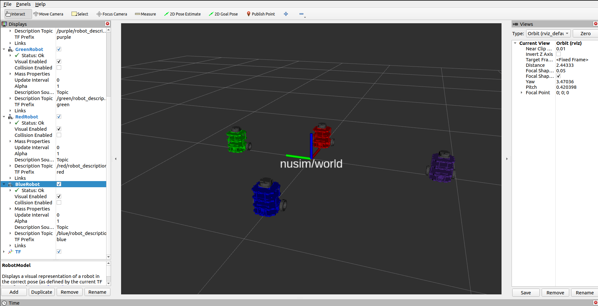

# Nuturtle  Description
URDF files for Nuturtle <Name Your Robot>
* `ros2 launch nuturtle_description load_one.launch.py  ` to see the robot in rviz.
* `<Command Here>` to see four copies of the robot in rviz.

* The rqt_graph when all four robots are visualized (Nodes Only, Hide Debug) is:

# Launch File Details
* `ros2 launch nuturtle_description load_one.launch.py --show-args`
  ```
    Arguments (pass arguments as '<name>:=<value>'):

    'use_jsp':
        true (default): use joint_state_publisher,false: no joint states published
        (default: 'true')

    'use_rviz':
        true (default): start rviz, otherwise don't start rviz
        (default: 'true')
```
* `<Command To Show Arguments of load_all.launch.py>`
  `<Output of the Above Command>`